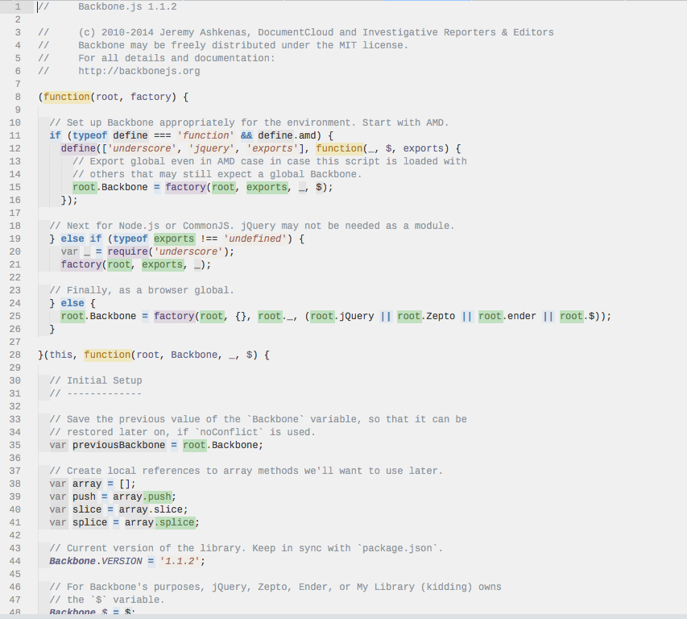

# Proton color scheme

This is a partial adaptation of the Vim [Proton color scheme](http://www.vim.org/scripts/script.php?script_id=2510) for use in Sulime Text 3.

Most support is present for JavaScript. Parts that are missing (e.g. in other languages) are filled in with the appropriate parts from Slush & Poppies.

## Screenshot

## Discussion

I'm a big fan of the Proton color scheme, and wanted to bring it to Sublime. Feel free to make adjustments and open pull requests.
